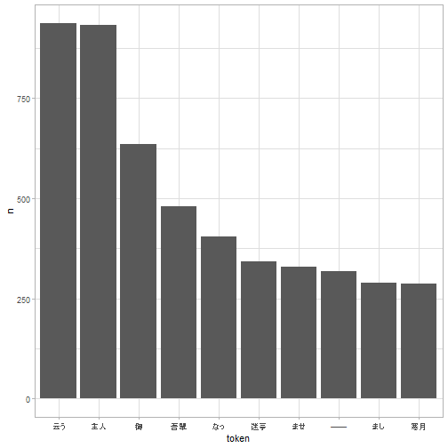
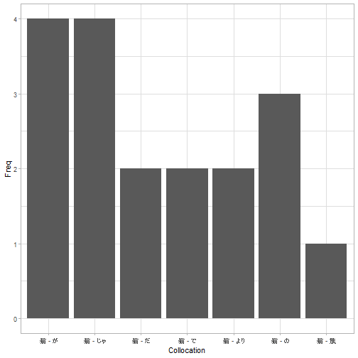
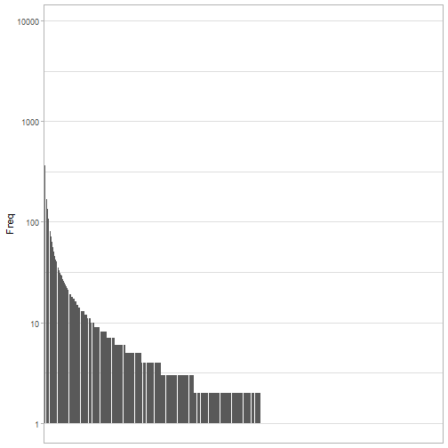
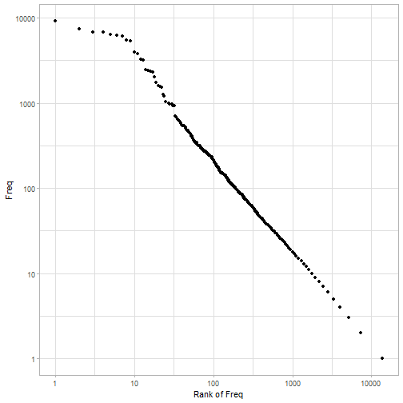

# NLP100knocks：形態素解析


## データの読み込み

テキストを読みこむだけなら本当は何でもよいのですが、ここでは次のような形のデータフレームにして持ちます。


```r
neko <- (function() {
  text <- readr::read_lines("https://nlp100.github.io/data/neko.txt", skip_empty_rows = TRUE)
  return(data.frame(doc_id = seq_along(text), text = text, stringsAsFactors = FALSE))
})()

str(neko)
#> 'data.frame':	9210 obs. of  2 variables:
#>  $ doc_id: int  1 2 3 4 5 6 7 8 9 10 ...
#>  $ text  : chr  "一" "　吾輩は猫である。" "名前はまだ無い。" "　どこで生れたかとんと見当がつかぬ。" ...
```

この形のデータフレームは、[Text Interchange Formats（TIF）](https://docs.ropensci.org/tif/)という仕様を念頭においたものです。

TIFに準拠した強力なRパッケージとして、[quanteda](https://quanteda.io/)があります。quantedaはTIFに準拠した独自のS4クラス（`corpus`, `tokens`, `dfm`など）を実装していて、とくに文書単語行列（Document-Term Matrix, DTM. quantedaではDocument-Feature Matrix, DFMと呼ばれている）を同じ形のデータフレームを介さずに疎行列オブジェクトとして持つことができるため、比較的大きめのテキストを扱ってもメモリ効率がよいという利点があります。

## 形態素解析

### 30. 形態素解析結果の読み込み

あらかじめ上の形のデータフレームとして文書集合を持っておくと、次のようにquantedaのcorpusオブジェクトに変換できます。


```r
temp <- quanteda::corpus(neko)
```

ただ、100本ノックではtokenごとに品詞情報を確認する処理が多く、quantedaを使うメリットはあまりないため、[RcppMeCab](https://github.com/junhewk/RcppMeCab)の返すデータフレームをそのまま使っていきます。

GitHubにある開発版でも動くのですが、やや処理が遅いため、以下では独自にリファクタリングしたもの（[paithiov909/RcppMeCab](https://github.com/paithiov909/RcppMeCab)）を使っています。なお、現在CRANにある最新のRcppMeCab（v.0.0.1.2）はWindows環境だとインストールにコケるはずなので、CRANにあるものを使う場合にはUNIX系の環境が必要です。

なお、このforkにあるRcppMeCabでは、特にオプションを指定しないかぎり、内部的に機械的に文区切りされます（ICUの[Boundary Analysis](https://unicode-org.github.io/icu/userguide/boundaryanalysis/)の仕様については、[UAX#29](https://www.unicode.org/reports/tr29/)を参照のこと）。


```r
neko_txt_mecab <- neko %>%
  dplyr::pull("text") %>%
  RcppMeCab::posParallel(format = "data.frame")

str(neko_txt_mecab)
#> 'data.frame':	206338 obs. of  7 variables:
#>  $ doc_id     : Factor w/ 9210 levels "1","10","100",..: 1 1112 1112 1112 1112 1112 1112 1112 2223 2223 ...
#>  $ sentence_id: Factor w/ 2 levels "1","2": 1 1 1 1 1 1 1 1 1 1 ...
#>  $ token_id   : int  1 1 2 3 4 5 6 7 1 2 ...
#>  $ token      : chr  "一" "　" "吾輩" "は" ...
#>  $ pos        : chr  "名詞" "記号" "名詞" "助詞" ...
#>  $ subtype    : chr  "数" "空白" "代名詞" "係助詞" ...
#>  $ analytic   : chr  "イチ" "　" "ワガハイ" "ハ" ...
```

### 31. 動詞


```r
neko_txt_mecab %>%
  dplyr::filter(pos == "動詞") %>%
  dplyr::select(token) %>%
  head()
#>   token
#> 1  生れ
#> 2  つか
#> 3    し
#> 4  泣い
#> 5    し
#> 6  いる
```

### 32. 動詞の原形

省略。RcppMeCabでは表層形（surface form）しか取れません。

### 33. 「AのB」


```r
neko_txt_mecab %>%
  tibble::rowid_to_column() %>%
  dplyr::filter(token == "の") %>%
  dplyr::pull(rowid) %>%
  purrr::keep(~ neko_txt_mecab$pos[. - 1] == "名詞" && neko_txt_mecab$pos[. + 1] == "名詞") %>%
  purrr::map_chr(~ stringr::str_c(
    neko_txt_mecab$token[. - 1],
    neko_txt_mecab$token[.],
    neko_txt_mecab$token[. + 1],
    collapse = ""
  )) %>%
  head(30L)
#>  [1] "彼の掌"     "掌の上"     "書生の顔"   "はずの顔"   "顔の真中"   "穴の中"    
#>  [7] "書生の掌"   "掌の裏"     "何の事"     "肝心の母親" "藁の上"     "笹原の中"  
#> [13] "池の前"     "池の上"     "一樹の蔭"   "垣根の穴"   "隣家の三"   "時の通路"  
#> [19] "一刻の猶予" "家の内"     "彼の書生"   "以外の人間" "前の書生"   "おさんの隙"
#> [25] "おさんの三" "胸の痞"     "家の主人"   "主人の方"   "鼻の下"     "吾輩の顔"
```

### 34. 名詞の連接

これよくわからない（もっと「Rらしい」書き方があるような気がする）。

Rのlistやvector（データフレームの「列」を含む）は、基本的に再代入するたびにメモリコピーが走るため、ループの内部などでサイズの大きいオブジェクトの変更を繰り返すと、非常に時間がかかってしまいます。やむをえずこのような処理をしたい場合、要素の削除については、削除したい要素を[zap](https://rlang.r-lib.org/reference/zap.html)というオブジェクトで置き換えるような書き方をすると、比較的現実的な時間内で処理できます。


```r
idx <- neko_txt_mecab %>%
  tibble::rowid_to_column() %>%
  dplyr::filter(pos == "名詞") %>%
  dplyr::pull(rowid) %>%
  purrr::discard(~ neko_txt_mecab$pos[. + 1] != "名詞")

search_in <- as.vector(idx, mode = "list") # as.listより速い（たぶん）

purrr::map_chr(search_in, function(idx) {
  itr <- idx
  res <- neko_txt_mecab$token[idx]
  while (neko_txt_mecab$pos[itr + 1] == "名詞") {
    res <- stringr::str_c(res, neko_txt_mecab$token[itr + 1])
    search_in <<- purrr::list_modify(
      search_in,
      !!!purrr::set_names(list(rlang::zap()), itr + 1)
    )
    itr <- itr + 1
    next
  }
  return(res)
}) %>%
  head(30L)
#>  [1] "人間中"       "一番獰悪"     "時妙"         "一毛"         "その後猫"    
#>  [6] "一度"         "ぷうぷうと煙" "邸内"         "三毛"         "書生以外"    
#> [11] "四五遍"       "五遍"         "この間おさん" "三馬"         "御台所"      
#> [16] "まま奥"       "住家"         "終日書斎"     "勉強家"       "勉強家"      
#> [21] "勤勉家"       "二三ページ"   "三ページ"     "主人以外"     "限り吾輩"    
#> [26] "朝主人"       "一番心持"     "二人"         "一つ床"       "一人"
```

### 35. 単語の出現頻度


```r
neko_txt_mecab %>%
  dplyr::group_by(token) %>%
  dplyr::count(token, sort = TRUE) %>%
  dplyr::ungroup() %>%
  head()
#> # A tibble: 6 x 2
#>   token     n
#>   <chr> <int>
#> 1 の     9194
#> 2 。     7486
#> 3 て     6868
#> 4 、     6772
#> 5 は     6420
#> 6 に     6243
```

これだと助詞ばかりでつまらないので、ストップワードを除外してみます。


```r
stopwords <-
  rtweet::stopwordslangs %>%
  dplyr::filter(lang == "ja") %>%
  dplyr::filter(p >= .98) %>%
  dplyr::pull(word)

`%without%` <- Negate(`%in%`)

neko_txt_mecab %>%
  dplyr::filter(pos != "記号") %>%
  dplyr::filter(token %without% stopwords) %>%
  dplyr::group_by(token) %>%
  dplyr::count(token, sort = TRUE) %>%
  dplyr::ungroup() %>%
  head()
#> # A tibble: 6 x 2
#>   token     n
#>   <chr> <int>
#> 1 云う    937
#> 2 主人    932
#> 3 御      636
#> 4 吾輩    481
#> 5 なっ    404
#> 6 迷亭    343
```

### 36. 頻度上位10語


```r
neko_txt_mecab %>%
  dplyr::filter(pos != "記号") %>%
  dplyr::filter(token %without% stopwords) %>%
  dplyr::group_by(token) %>%
  dplyr::count(token, sort = TRUE) %>%
  dplyr::ungroup() %>%
  head(10L) %>%
  ggplot2::ggplot(aes(x = reorder(token, -n), y = n)) +
  ggplot2::geom_col() +
  ggplot2::labs(x = "token") +
  ggplot2::theme_light()
```



### 37. 「猫」と共起頻度の高い上位10語

解釈のしかたが複数あるけれど、ここでは段落ごとのbi-gramを数えることにします。


```r
neko_txt_mecab %>%
  tibble::rowid_to_column() %>%
  dplyr::filter(token == "猫") %>%
  dplyr::mutate(Collocation = stringr::str_c(token, neko_txt_mecab$token[rowid + 1], sep = " - ")) %>%
  dplyr::group_by(doc_id, Collocation) %>%
  dplyr::count(Collocation, sort = TRUE) %>%
  dplyr::ungroup() %>%
  head(10L) %>%
  ggplot2::ggplot(aes(x = reorder(Collocation, -n), y = n)) +
  ggplot2::geom_col() +
  ggplot2::labs(x = "Collocation", y = "Freq") +
  ggplot2::theme_light()
```



### 38. ヒストグラム


```r
neko_txt_mecab %>%
  dplyr::group_by(token) %>%
  dplyr::count(token) %>%
  ggplot2::ggplot(aes(x = reorder(token, -n), y = n)) +
  ggplot2::geom_col() +
  ggplot2::labs(x = NULL, y = "Freq") +
  ggplot2::scale_x_discrete(breaks = NULL) +
  ggplot2::scale_y_log10() +
  ggplot2::theme_light()
```



### 39. Zipfの法則


```r
count <- neko_txt_mecab %>%
  dplyr::group_by(token) %>%
  dplyr::count(token) %>%
  dplyr::ungroup()
count %>%
  tibble::rowid_to_column() %>%
  dplyr::mutate(rank = nrow(count) + 1 - dplyr::min_rank(count$n)[rowid]) %>%
  ggplot2::ggplot(aes(x = rank, y = n)) +
  ggplot2::geom_point() +
  ggplot2::labs(x = "Rank of Freq", y = "Freq") +
  ggplot2::scale_x_log10() +
  ggplot2::scale_y_log10() +
  ggplot2::theme_light()
```



## セッション情報


```r
sessioninfo::session_info()
#> - Session info -----------------------------------------------------------------------
#>  setting  value
#>  version  R version 4.1.2 (2021-11-01)
#>  os       Windows 10 x64 (build 19043)
#>  system   x86_64, mingw32
#>  ui       RStudio
#>  language (EN)
#>  collate  Japanese_Japan.932
#>  ctype    Japanese_Japan.932
#>  tz       Asia/Tokyo
#>  date     2022-03-03
#>  rstudio  2022.02.0+443 Prairie Trillium (desktop)
#>  pandoc   2.17.1.1 @ C:/Program Files/RStudio/bin/quarto/bin/ (via rmarkdown)
#> 
#> - Packages ---------------------------------------------------------------------------
#>  ! package      * version     date (UTC) lib source
#>    assertthat     0.2.1       2019-03-21 [1] CRAN (R 4.1.2)
#>    backports      1.4.1       2021-12-13 [1] CRAN (R 4.1.2)
#>    bit            4.0.4       2020-08-04 [1] CRAN (R 4.1.2)
#>    bit64          4.0.5       2020-08-30 [1] CRAN (R 4.1.2)
#>    cli            3.2.0       2022-02-14 [1] CRAN (R 4.1.2)
#>    colorspace     2.0-3       2022-02-21 [1] CRAN (R 4.1.2)
#>    crayon         1.5.0       2022-02-14 [1] CRAN (R 4.1.2)
#>    curl           4.3.2       2021-06-23 [1] CRAN (R 4.1.2)
#>    DBI            1.1.2       2021-12-20 [1] CRAN (R 4.1.2)
#>    digest         0.6.29      2021-12-01 [1] CRAN (R 4.1.2)
#>    dplyr          1.0.8       2022-02-08 [1] CRAN (R 4.1.2)
#>    ellipsis       0.3.2       2021-04-29 [1] CRAN (R 4.1.2)
#>    evaluate       0.15        2022-02-18 [1] CRAN (R 4.1.2)
#>    fansi          1.0.2       2022-01-14 [1] CRAN (R 4.1.2)
#>    farver         2.1.0       2021-02-28 [1] CRAN (R 4.1.2)
#>    fastmap        1.1.0       2021-01-25 [1] CRAN (R 4.1.2)
#>    fastmatch      1.1-3       2021-07-23 [1] CRAN (R 4.1.1)
#>    generics       0.1.2       2022-01-31 [1] CRAN (R 4.1.2)
#>    ggplot2      * 3.3.5       2021-06-25 [1] CRAN (R 4.1.2)
#>    glue           1.6.2       2022-02-24 [1] CRAN (R 4.1.2)
#>    gtable         0.3.0       2019-03-25 [1] CRAN (R 4.1.2)
#>    highr          0.9         2021-04-16 [1] CRAN (R 4.1.2)
#>    hms            1.1.1       2021-09-26 [1] CRAN (R 4.1.2)
#>    htmltools      0.5.2       2021-08-25 [1] CRAN (R 4.1.2)
#>    httr           1.4.2       2020-07-20 [1] CRAN (R 4.1.2)
#>    jsonlite       1.8.0       2022-02-22 [1] CRAN (R 4.1.2)
#>    knitr          1.37        2021-12-16 [1] CRAN (R 4.1.2)
#>    labeling       0.4.2       2020-10-20 [1] CRAN (R 4.1.1)
#>    lattice        0.20-45     2021-09-22 [2] CRAN (R 4.1.2)
#>    lifecycle      1.0.1       2021-09-24 [1] CRAN (R 4.1.2)
#>    magrittr     * 2.0.2       2022-01-26 [1] CRAN (R 4.1.2)
#>    Matrix         1.3-4       2021-06-01 [2] CRAN (R 4.1.2)
#>    munsell        0.5.0       2018-06-12 [1] CRAN (R 4.1.2)
#>    pillar         1.7.0       2022-02-01 [1] CRAN (R 4.1.2)
#>    pkgconfig      2.0.3       2019-09-22 [1] CRAN (R 4.1.2)
#>    purrr          0.3.4       2020-04-17 [1] CRAN (R 4.1.2)
#>    quanteda       3.2.1       2022-03-01 [1] CRAN (R 4.1.2)
#>    R.cache        0.15.0      2021-04-30 [1] CRAN (R 4.1.2)
#>    R.methodsS3    1.8.1       2020-08-26 [1] CRAN (R 4.1.1)
#>    R.oo           1.24.0      2020-08-26 [1] CRAN (R 4.1.1)
#>    R.utils        2.11.0      2021-09-26 [1] CRAN (R 4.1.2)
#>    R6             2.5.1       2021-08-19 [1] CRAN (R 4.1.2)
#>    Rcpp           1.0.8       2022-01-13 [1] CRAN (R 4.1.2)
#>    RcppMeCab      0.0.1.3.900 2022-01-17 [1] local
#>  D RcppParallel   5.1.5       2022-01-05 [1] CRAN (R 4.1.2)
#>    readr          2.1.2       2022-01-30 [1] CRAN (R 4.1.2)
#>    rematch2       2.1.2       2020-05-01 [1] CRAN (R 4.1.2)
#>    rlang          1.0.1       2022-02-03 [1] CRAN (R 4.1.2)
#>    rmarkdown      2.11        2021-09-14 [1] CRAN (R 4.1.2)
#>    rstudioapi     0.13        2020-11-12 [1] CRAN (R 4.1.2)
#>    rtweet         0.7.0       2020-01-08 [1] CRAN (R 4.1.2)
#>    scales         1.1.1       2020-05-11 [1] CRAN (R 4.1.2)
#>    sessioninfo    1.2.2       2021-12-06 [1] CRAN (R 4.1.2)
#>    stopwords      2.3         2021-10-28 [1] CRAN (R 4.1.2)
#>    stringi        1.7.6       2021-11-29 [1] CRAN (R 4.1.2)
#>    stringr        1.4.0       2019-02-10 [1] CRAN (R 4.1.2)
#>    styler         1.6.2       2021-09-23 [1] CRAN (R 4.1.2)
#>    tibble         3.1.6       2021-11-07 [1] CRAN (R 4.1.2)
#>    tidyselect     1.1.2       2022-02-21 [1] CRAN (R 4.1.2)
#>    tzdb           0.2.0       2021-10-27 [1] CRAN (R 4.1.2)
#>    utf8           1.2.2       2021-07-24 [1] CRAN (R 4.1.2)
#>    vctrs          0.3.8       2021-04-29 [1] CRAN (R 4.1.2)
#>    vroom          1.5.7       2021-11-30 [1] CRAN (R 4.1.2)
#>    withr          2.4.3       2021-11-30 [1] CRAN (R 4.1.2)
#>    xfun           0.29        2021-12-14 [1] CRAN (R 4.1.2)
#>    yaml           2.3.5       2022-02-21 [1] CRAN (R 4.1.2)
#> 
#>  [1] C:/R/win-library/4.1
#>  [2] C:/Program Files/R/R-4.1.2/library
#> 
#>  D -- DLL MD5 mismatch, broken installation.
#> 
#> --------------------------------------------------------------------------------------
```


